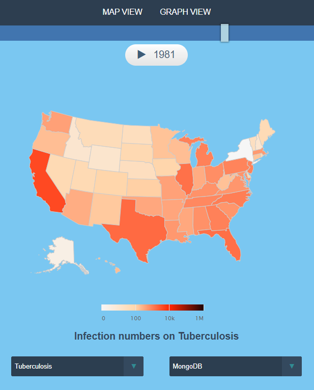
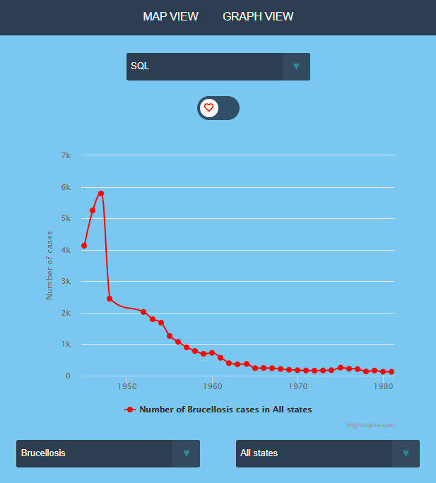

# Tycho-Based Database System with Interactive Frontend

A database system featuring an interactive user interface to analyze historical data on diseases in USA. 

By DB Penguins.

This is a project within IKT446 ICT Seminar 4 Database Management
at University of Agder (UiA), Grimstad 2020. 

This project implements a database system to visualize and analyze disease data from [Project Tycho](https://www.tycho.pitt.edu/). The system uses three different database approaches: [MySQL](https://www.mysql.com/), [MongoDB](https://www.mongodb.com/) and [Neo4j](https://neo4j.com/). This project was built using the [Lumen - PHP Micro-Framework](https://lumen.laravel.com/).

## User Interface

The frontend has two different interactive views. Both of these use aggregated data from the database. The user can select which database to load from (MySQL, MongoDB or Neo4j).

### 1. Interactive Map

Here the user can select a year, a disease and which database to use. 

### 2. Historical Graph

Here the user can select a database, a disease and an American state. 

## Using this Project

To use this project, please follow the instructions on how to setup and install [Laravel Homestead](https://laravel.com/docs/8.x/homestead). 
We recommend using [Vagrant](https://www.vagrantup.com/) with [Oracle VM VirtualBox](https://www.virtualbox.org/) for the best experience. 

### Homestead.yaml Configuration

In the _C:/.../Homestead/Homestead.yaml_ file, please map the folder _C:\...\db-penguins_ to _/home/vagrant/db-penguins_. Map the site _homestead.test_ to _/home/vagrant/db-penguins/public_. Please also enable _mongodb_, and _neo4j_. 

    folders:
        - map: C:\...\db-penguins
          to: /home/vagrant/db-penguins

    sites:
        - map: homestead.test
          to: /home/vagrant/db-penguins/public

    databases:
        - homestead
    
    features:
        - mongodb: true
        - neo4j: true

### Preparation

The next step is to clone this GitHub repository to your local machine (_C:/.../db-penguins_). 
Then make a new folder inside _db-penguins_ called 'data' which will contain Project Tycho dataset files. Please place a compiled Project Tycho CSV dataset file into the 'data' folder. You can use pre-compiled data or compile you own at the Project Tycho homepage. 

### Initializing ODB and ADB tables

Please start the virtual machine from within your Homestead folder:

    @c:/.../Homestead
    vagrant up

We recommend using [JetBrains PhpStorm](https://www.jetbrains.com/phpstorm/) to open the _db-penguins_ project folder. In PhpStorm with the project open, create a new MySQL data source.
If you are using Homestead with the default configuration you can set up the data source like this:

    Name: Homestead
    User: homestead
    Password: secret
    Port: 33060
    Host: 127.0.0.1

Check the connection, then hit apply. 

In PhpStorm still, you should run the scripts: _create_odb.sql_ and _create_adb.sql_. These scripts are located in the _db-penguins/database_ folder. 
This will create empty ODB and ADB tables for the database. 

### Data Loading

Now you can load Project Tycho data into the database. 
We have added a couple of commands to do this which can be used from a command-line interface (CLI). 
Here we assume you have set up Homestead as we have recommended. 

    @c:/.../Homestead
    vagrant ssh
    cd db-penguins

You can get a list of available commands by typing:

    php artisan list

You can load ODB data from a compiled Project Tycho CSV file like this:

    php artisan dw:load data/filename.csv --truncate

Use the _--truncate_ option to clear all existing data in the database. 
If you want to append new data, ignore this option. 

Now we can load the ADBs by using the following commands:
  
    php artisan dw:loadSqlAdb
    php artisan dw:loadmongodb
    php artisan dw:loadneo4j

Open _homestead.test_ in a web browser to test out the application. 
